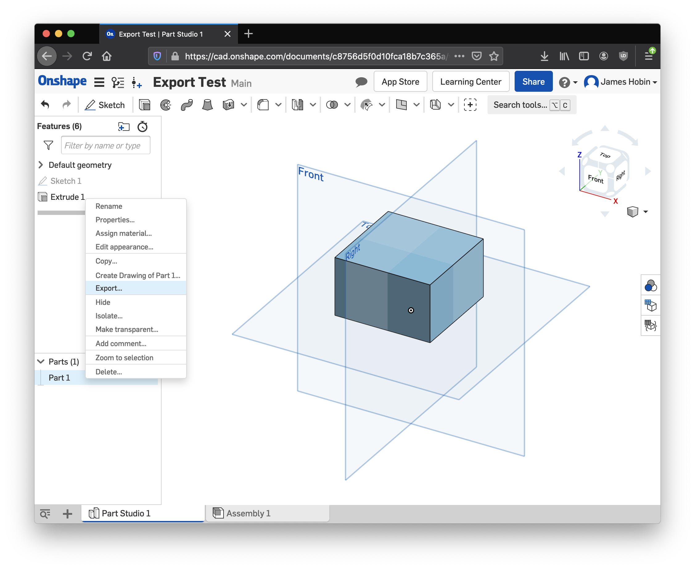
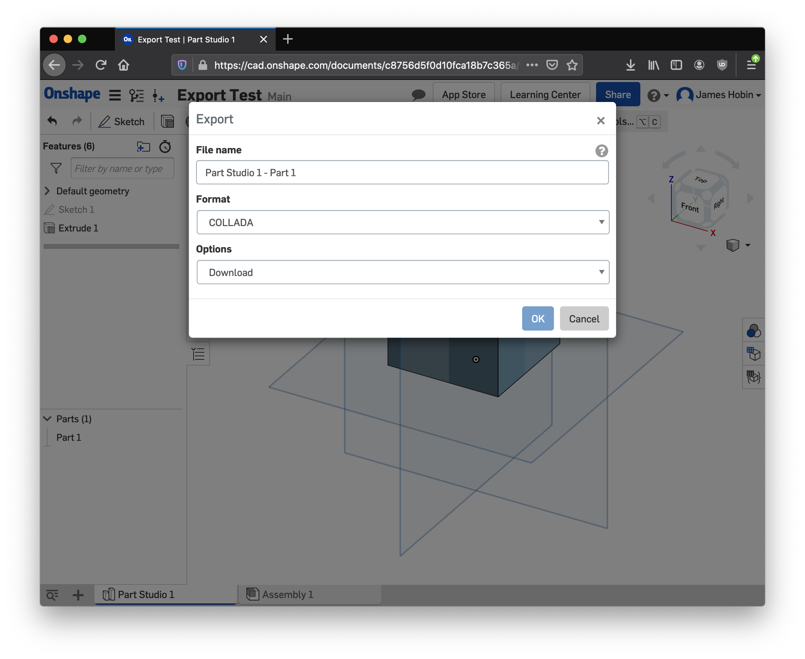

# threejs + collada tool example

This is based on https://spatialtoolbox.vuforia.com/docs/tutorials/three-js-tool-tutorial so read that first if you haven't.

The key addition to that code is customizing the content in the scene's container object:

```javascript
const loader = new ColladaLoader();
loader.load('./assets/export.dae', function(collada) {
  containerObj.add(collada.scene);
});
```

Note that depending on your model you may have to adjust
`collada.scene.position`, `collada.scene.rotation`, and `collada.scene.scale`.

## Exporting from Onshape

Right click either your part or assembly and select "Export." You can now refer
to this downloaded file in your tool.




